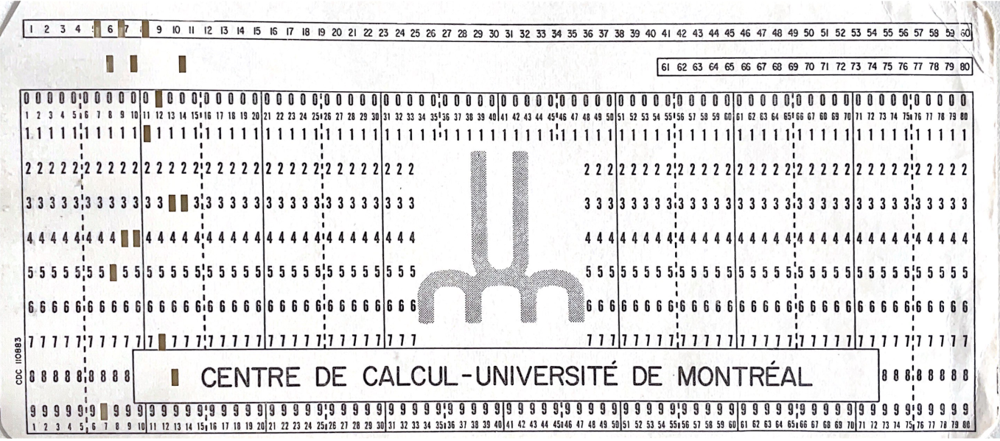
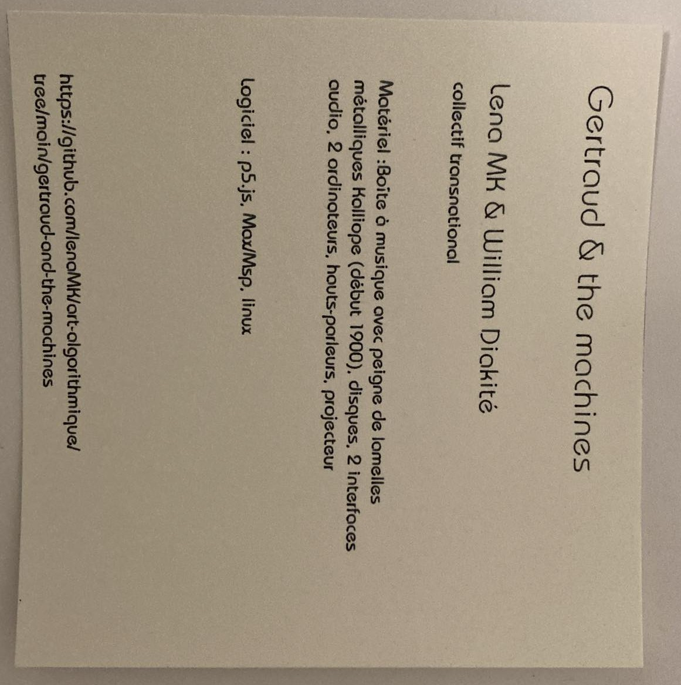
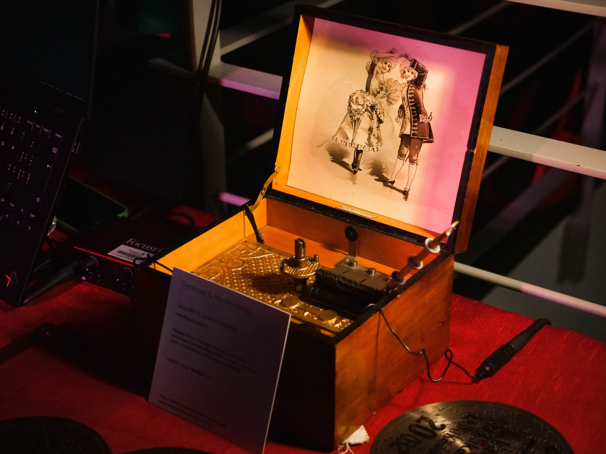
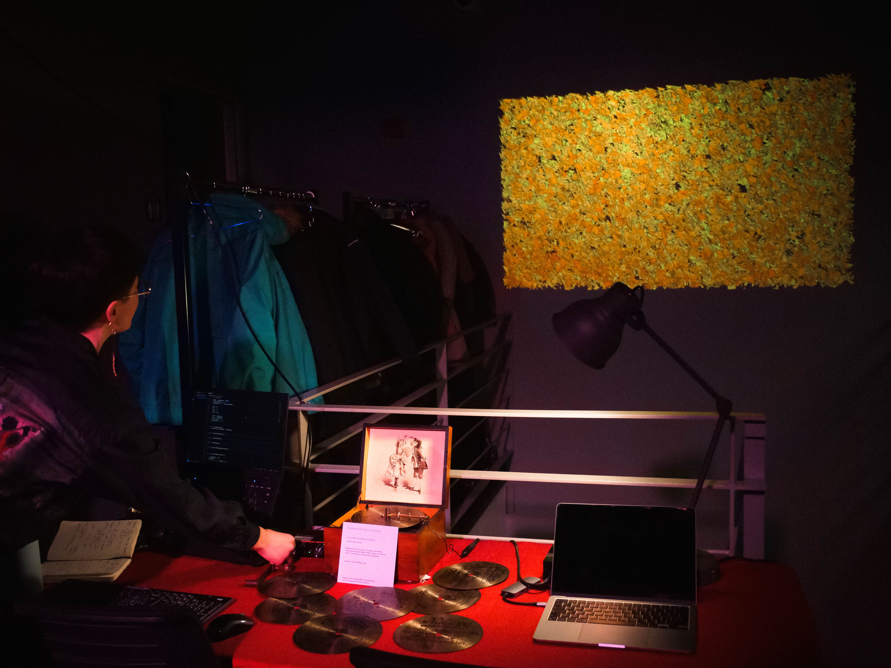

## Description du projet 

*Gertraud & the machines* explore une rencontre entre le passé et le présent technologiques à partir d’une boîte à musique de la fin du XIXe siècle. Dans l’espace de l’installation, l’objet historique se démultiplie par la juxtaposition de pratiques d’art algorithmique audiovisuelles. De l’apparence d’un cube en bois, la boîte à musique s’ouvre pour laisser apparaître les pièces métallisées de l’instrument à lamelle et du mécanisme de rotation des disques. L’intérieur du couvercle est orné d’une estampe de deux personnes qui dansent tout en fixant les spectateur·rice·s. Des disques en métal mettent à disposition une sélection de pièces musicales. Le titre du morceau est indiqué au recto tandis que le verso est rythmé de piques qui déclenchent les lamelles faisant jouer l’instrument. Une fois le disque placé, une manivelle permet de remonter le mécanisme qui s’enclenche à l’aide d’un petit interrupteur. L’installation place la boîte à musique comme source de données pour des ordinateurs. Un premier algorithme prend le son qu’elle produit pour générer une trame sonore. L’expérience musicale, autrement un peu redondante puisque les mélodies «&nbsp;tournent en rond&nbsp;», est transformée et enrichie par la composition contemporaine. Un second algorithme alterne entre plusieurs visualisations qui traduisent, en temps réel, le son en une animation visuelle. Accompagnée par ces créations audiovisuelles, la perception de la boîte à musique par le public oscille entre l’objet de curiosité historique et l’installation d’art numérique.

La première itération de *Gertraud & the machines* a été créée pour une exposition d’art algorithmique à l’UdeM (vernissage-exposition, 28 mars 2024). L’installation était constituée d’une grande table sur laquelle étaient installées la boîte à musique, deux micros piézoélectriques et deux interfaces audio connectées chacune à un ordinateur. Un premier ordinateur montrait à l’écran le code source des visualisations créées en p5.js et le résultat visuel était diffusé sur le mur en face avec un projecteur. Le second ordinateur montrait l’interface de Max/Msp et diffusait dans des enceintes le son généré par le logiciel. L’activation de l’installation, d’une durée d’environ 6min, a commencé par le fait de placer un disque dans la boîte à musique, crinquer le mécanisme pour la remonter puis de le démarrer. Au fur et à mesure, un total de six formes visuelles ont été formées/animées par le son de la boîte à musique, que ce soit par les mélodies inscrites dans les disques ou par le son produit lors du changement de disque par exemple. Durant le reste de la soirée, le public était invité à manipuler le dispositif avec l’accompagnement des artistes.

Pour cette deuxième itération, nous aimerions explorer l’enjeu de présenter une boîte à musique sans pouvoir l’utiliser. Comment donner accès à la boîte à musique alors qu’on ne peut pas la toucher ni la faire jouer? La boîte à musique demeurerait la pièce maîtresse exposée. Soulever les écouteurs déclencherait les visualisations sur le projecteurs et le son diffusé dans les écouteurs, générés par une bande-son préenregistrée. Celle-ci comporterait notamment des extraits pré-enregistrés de différents sons produits par la boîte à musique ─ dont les mélodies de différents disques, les sons du mécanisme et les bruits produits par sa manipulation ─ mais inclurait également des archives sonores, tels que la voix de Gertraud (grand-mère de Lena) chez qui Lena a trouvé la boîte à musique.  Ainsi, la contrainte sonore (qui empêche l’utilisation *live* de la boîte à musique) devient une opportunité de travailler sur l’histoire matérielle et sonore de l’objet dans le cadre de cette proposition.

## Démarche en recherche-création

[Lena] J’ai trouvé cette boîte à musique au fond d’un garde-robe chez ma grand-mère. Elle m’a tout de suite intriguée et fascinée, d’une part en tant qu’objet clairement venu d’une autre époque, mais d’autre part pour sa matérialité et sa manipulation. J’ai tout de suite demandé à ma grand-mère si je pouvais la garder, sans savoir quoi en faire pour autant. Je l’ai d’abord ramenée chez mes parents en Suisse puis je l’ai récemment apportée avec moi à Montréal. Son transfert vers mon lieu de vie et d’études ─ alors que je commençais mon projet de mon doctorat en visualisation de données et que je m’intéressais de plus en plus à l’histoire de l’informatique ─ me l’a soudain fait voir sous un nouvel angle. Les disques m’ont distinctement rappelée la carte perforée reçue l’été précédant lors d’une discussion sur l’histoire de l’informatique avec Prof Guy Lapalme, un autre objet obsolète retrouvé au fond d’un tiroir. Comme ce sont des objets hétéroclites, j’avais vraiment besoin de les placer côte à côte, de les manipuler pour sentir et réfléchir d’avantage à leur ressemblances. Quelques recherches m’ont permis de trouver une boîte à musique qui permet d’utiliser une [carte perforée comme partition](https://www.youtube.com/watch?v=HXlqGqibxgY). J’ai également retrouvé l’histoire de la production de ces boîte à musiques de type *Symphonium* et *Polyphon*, ou *Kalliope* pour celle qui fait l’objet de l’installation, en faisant des recherches sur le web ([Collector’s World](https://collectorsworldinc.com/disc.php), [National Museum of American History](https://americanhistory.si.edu/collections/nmah_608010), [Sound and Science database](https://soundandscience.net/artefacts/symphonion-music-box/)) ainsi qu’à partir d’une [page Wikipedia](https://en.wikipedia.org/w/index.php?title=Music_box) dédiée à ces objets. 

Amie et collègue de William depuis plusieurs années, je savais qu’il s’intéresserait à ces objets, en tant qu’ingénieur et développeur qui a aussi travaillé la visualisation de données. Désormais étudiant en composition à la faculté de musique de l’UdeM, c’est justement en lui montrant la boîte à musique que j’ai réalisé qu’il y avait un lien entre mon projet de thèse et la boîte à musique L’inscription visuelle et matérielle des données dans leur support m’intéresse particulièrement; j’ai notamment commencé à explorer la physicalisation de données lorsque la visualisation à l’écran ne me semblait pas satisfaisante. 

[Lena et William] Ce projet de recherche-création est né d’une envie de travailler l’histoire de l’objet, sa matière et sa matérialité, tout en l’inscrivant dans le contexte contemporain, dans lequel nous travaillons tout deux quotidiennement en informatique. Nous avons ainsi commencé à explorer ces enjeux en les joignant à nos parcours créatifs en composition et en visualisation de données [^1]. Cette itération nous permettrait de continuer à travailler ensemble sur nos intérêts communs en création algorithmique tout en explorant de nouveaux aspects du projets, tels que la recherche dans les archives familiales de Lena MK. Le nouveau format, celui de l’exposition en galerie, amène certains défis techniques dont seule l’expérience *in situ* nous permettra de nous former à ces enjeux. En définitive, il s’agit d’une très riche opportunité de créer une nouvelle itération pour ce projet.

[^1]: Une des premières idées était notamment de créer de nouveaux disques pour la boîte à musique. Nous gardons l’idée pour une potentielle itération future.

## Fiche technique

| Titre                                       | Gertraud & the machines                                      |
| ------------------------------------------- | ------------------------------------------------------------ |
| Créateurs                                   | William Diakité et Lena MK                                   |
| Date de création                            | 2024                                                         |
| Matériel                                    | Boîte à musique avec peigne de lamelles métalliques Kalliope (début 1900), disques, manivelle. **Itération 1**: 2 interfaces audio, 2 micros piézoélectriques, 2 ordinateurs, hauts-parleurs, projecteur.  **Itération 2**: 1 paire d’écouteurs ou douche de son, 1 projecteur, socle sur mesure, arduino ou autre dispositif pour gérer le contenu audiovisuel. |
| Personnel pour l’installation               | Par William et Lena, avec l’aide d’un·e technicien·ne de la galerie |
| Durée estimée d’installation                | Une demi-journée                                             |
| Dispositif d’installation                   | Socle fabriqué sur mesure pour exposer la boîte à musique et ses artefacts tout en servant de support pour les écouteurs et l’interrupteur lié à leur prise en main (fabrication maison). À l’intérieur: le dispositif type arduino pour gérer les contenus audiovisuels et le projecteur (sauf si on l’accroche au-dessus, selon les possibilités techniques sur place).  Le socle doit pouvoir être connecté à une prise de courant électrique pour alimenter le projecteur notamment |
| Matériel technique à fournir par la galerie | 1 projecteur, surface pour projection (mur blanc ou gris dans un environnement suffisamment sombre pour que la projection soit visible), écouteurs ou douche de son, éclairage pour la boîte à musique (si possible dont on peut gérer l’alimentation avec notre interrupteur), multiprise à mettre dans le socle (~3 prises), câble HDMI ou équivalent |
| Matériel fourni par les créateurs           | Boîte à musique, socle sur mesure, dispositif pour déclencher l’installation (aduino) |

Cartel de l’exposition d’art algorithmique (conçu à partir d’un fichier JSON, généré par un algorithme et physicalisé avec un *pen plotter*) 

Photographies de l’installation lors de l’exposition d’art algorithmique

[Lien](https://u.pcloud.link/publink/show?code=XZv0PO0ZkTX4t4Up7LyBzofTFYhc17XcOOqy) vers un très bref extrait d’une vidéo de la première itération. Nous n’avons malheureusement pas plus de captations vidéo ni d’extraits audio de cet événement.

## Plan de salle

L’installation dans la salle requiert un accès à une prise, un espace suffisamment sombre pour la projection (l’affichage sur un écran plutôt que par projection est négociable en cas de dernier recourt), de l’éclairage mettant en valeur la boîte à musique posée sur le socle (dimension du socle: similaire à un petit îlot de cuisine, soit environ 24’’ x 20’’ x 30’’). Le socle doit se trouver une distance raisonnable du mur pour permettre la projection ainsi que la circulation autour de la boîte à musique.

Le fond de la galerie semble plus propice à un éclairage réduit, en utilisant la prise située le long du mur qui mène de l’entrée de la galerie au bureau Elektra. Possibilité d’utiliser un rideau pour réduire la luminosité ambiante.

