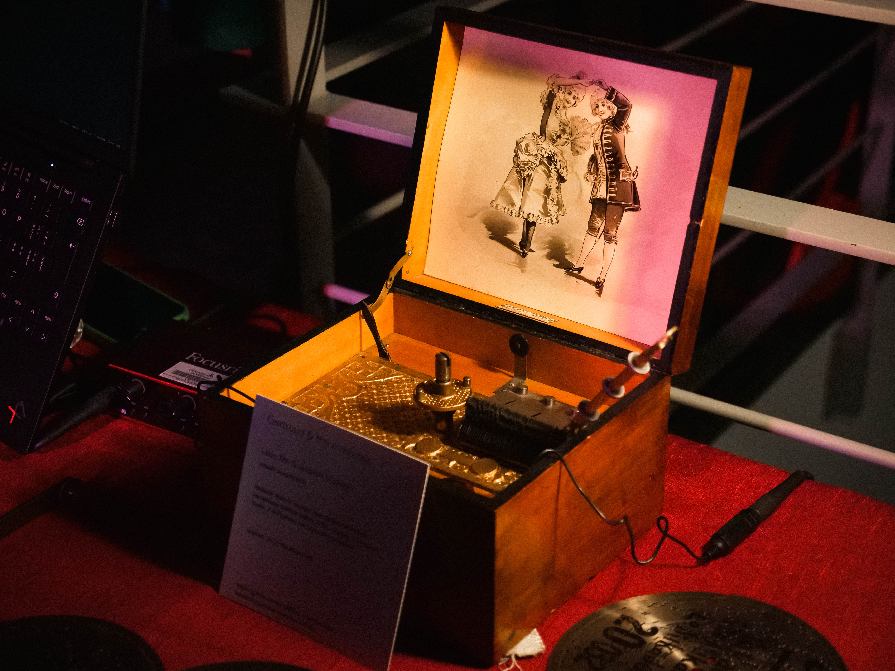
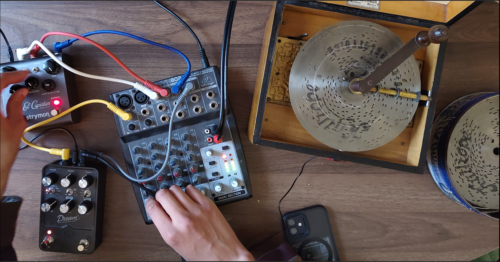

# Gertraud & the machines

Lena MK & William Diakité

*Gertraud & the machines* explore une rencontre entre le passé et le présent technologiques à partir d’une boîte à musique de la fin du XIXe siècle.

Dans l’espace de l’installation, l’objet historique se démultiplie par la juxtaposition de pratiques d’art algorithmique audiovisuelles. La boîte à musique devient une source de données pour des ordinateurs. Un premier algorithme prend le son qu’elle produit pour générer une trame sonore. L’expérience musicale, autrement un peu redondante puisque les mélodies «&nbsp;tournent en rond&nbsp;», est transformée et enrichie par la composition contemporaine. Un second algorithme alterne entre plusieurs visualisations qui traduisent, en temps réel, le son en une animation visuelle. Accompagnée par ces créations audiovisuelles, la perception de la boîte à musique par le public oscille entre l’objet de curiosité historique et l’installation d’art numérique.

## Itérations

1. [Vernissage d'art algorithmique](https://rethread.art/code/algorithmicart2024-vernissage/), 28 mars 2024 au carrefour des arts et sciences, Université de Montréal

2. [Soirée de la réunion plénière Revue 3.0](https://revue30.org/evenements/reunion-pleniere-2025/), rencontre en présence des membres du partenariat *Revue3.0 : Écrire, Transmettre, Découvrir*, 19 novembre 2025 à la buvette Beaubien

Archive des propositions de projet: 
- [Appel à exposition étudiante](./2024-08_propositionElektraHexagram.md), Hexagram et Elektra, août 2024
- [Appel à résidence de recherche-création](./2024-11_propositionResidenceDaimon.md), Daimon, novembre 2024

---

Merci à [Alexandre Sasset](https://sasset.ca/) et à [Rémy Jannelle](https://www.remyjannelle.com/) pour leur atelier de sonification d'objet (tenu le 13 novembre 2025 au [Bricolab](https://bricolab.org)!) où nous avons fabriqués des microphones piézoélectriques. Un bel ajout à notre équipement!